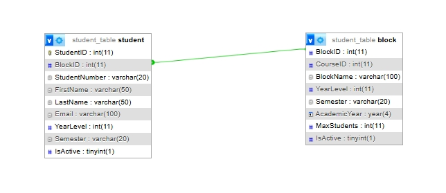

# WEB SYSTEMS AND TECHNOLOGIES: FINAL PROJECT DOCUMENTATION

**Module Focus: Relational Student CRUD Management System**

---

## 1. Project Overview

* **Original Project Title:** CLASS SCHEDULER SYSTEM WITH RECOMMENDER ENGINE
* **Original Authors/Source:**
  * Asia, Annie Rose M.
  * Bitare, John Reymar M.
  * Nebres, Ma. Gella Rose V.
  * Saavedra, Kierzhan Ric H.
* **Module Scope:** This module isolates and manages the complete lifecycle of student registration records. It tracks academic enrollment distributions across different class blocks, manages real-time active/inactive student statuses, and dynamically calculates enrollment analytics dashboard metrics without maintaining or relying on an isolated course-table dependency.
* **Rationale:** Traditional student record keeping often suffers from data redundancy and mismatched column alignments when flat fields change. By decoupling structural student metadata from a rigid standalone course table and instead dynamically pulling related context via Class Blocks, this module minimizes database size, enforces strict structural validation rules, and presents a clean, responsive layout interface for administrators.

---

## 2. Technology Stack

* **Frontend Framework:** Vanilla JavaScript (ES6+ Asynchronous DOM manipulation)
* **Styling:** Native CSS3 (utilizing CSS Grid layout architecture)
* **Backend Framework:** Node.js with Express.js application routing middleware
* **Database:** MySQL 8.0 relational database engine (managed via XAMPP phpMyAdmin)
* **Additional Libraries:**
  * `cors`: Handles Cross-Origin Resource Sharing security protocols between frontend and backend environments.
  * `mysql2`: High-performance asynchronous MySQL connector pool utility utilizing Promises.

---

## 3. Database Design

This module implements a normalized **One-to-Many ($1:\infty$) relationship**. A single academic class block can contain many registered students, while an individual student can be assigned to exactly one class block.

Below is the Entity-Relationship Diagram for the student registration module showing the relationship link:



### Table Structure Specifications

#### Table A: `block`
* `BlockID`: **INT(11)** | *Primary Key* | Auto-Increment anchor.
* `CourseID`: **INT(11)** | Foreign reference tracking structural programs.
* `BlockName`: **VARCHAR(100)** | e.g., "BSIT 1-A", "BSCS 2-A".
* `YearLevel`: **INT(11)** | Digital curriculum tracker layer.
* `Semester`: **VARCHAR(20)** | e.g., "1st", "2nd".
* `AcademicYear`: **YEAR(4)** | Standard institutional calendar footprint.
* `MaxStudents`: **INT(11)** | Classroom size threshold index.
* `IsActive`: **TINYINT(1)** | Binary switch status tracker.

#### Table B: `student`
* `StudentID`: **INT(11)** | *Primary Key* | System internal identifier (Auto-Incrementing).
* `BlockID`: **INT(11)** | *Foreign Key* | Connects directly to `block.BlockID` with `CASCADE` index rules.
* `StudentNumber`: **VARCHAR(20)** | Unique alpha-numeric tracking sequence.
* `FirstName`: **VARCHAR(50)** | Legal text entry parameter.
* `LastName`: **VARCHAR(50)** | Surname tracking entry parameter.
* `Email`: **VARCHAR(100)** | Validated university endpoint address.
* `IsActive`: **TINYINT(1)** | Current registration presence flag.

---

## 4. Module Features

This section describes how the application implements each CRUD (Create, Read, Update, Delete) operation to handle student tracking data.

### Create (C) — Add New Student
* **Feature Description:** Allows administrators to register a new student profile into the system using a dedicated input form. Instead of manually typing courses or text parameters, the system maps assignment relationships directly using a dynamic selection dropdown powered by backend relational data.
* **Form Validation Rules:**
  * All active form fields (`Student Number`, `First Name`, `Last Name`, `Email Address`, `Assigned Block`, `Year Level`, `Semester`, and `Status`) use the native browser `required` attribute to lock out partial or blank submissions.
  * The `Email` input field validates that data follows a standard corporate text template string structure (e.g., `name@student.edu`) before allowing submission.
  * The selected block maps directly to its unique database integer primary key (`BlockID`), preventing invalid structural assignments.
* **Error Handling:** If a user tries to submit a duplicate unique entry or if the backend database disconnects, the Express server intercepts the failure and returns a clean `500 Internal Server Error` message alert via browser alert boxes rather than crashing the system frontend loop.

### Read (R) — Master Roster & Live Analytics Dashboard
* **Feature Description:** Dynamically fetches and displays all registered student rows from the database inside a responsive data grid layout optimized into a 10-column tracking architecture. It also computes real-time summary indicators inside top-level metric card displays.
* **Relational Database Integration:** Rather than pulling un-normalized flat records, the backend runs a SQL `INNER JOIN` query to combine tables on the fly:
  ```sql
  SELECT s.StudentID, s.StudentNumber, s.FirstName, s.LastName, s.Email, s.IsActive, b.BlockName, b.YearLevel, b.Semester 
  FROM student s 
  INNER JOIN block b ON s.BlockID = b.BlockID;

## 6. Individual Reflection

This section contains the mandatory individual project reflections for each team member.

---

### 👤 Member 1: Brizuela, Atasha Karene B.

* **What was the most difficult part of interpreting the original author's logic?**<br> 
  Our reviewed capstone project is entitled “Class Scheduler System with Recommender Engine.” The most difficult part for me was understanding the Recommender Engine feature. At first, it was quite confusing because I thought it was something very complex. Even the word “engine” itself made me feel overwhelmed, and I had difficulty understanding how it worked and how it contributed to the system.
  
* **What technical challenges did you face during recreation?**<br>
  One of the biggest challenges I faced was working on the backend part of the system, especially using JavaScript to connect the frontend and backend. I did not fully know how to make them work together at first. Fortunately, learning resources such as W3Schools and AI tools helped guide me through the step-by-step process of achieving the connection and understanding how it works.

* **How would you improve this module further?**<br> 
  If given the opportunity to improve this module further, I would make the interface more user-friendly and easier to navigate. I would also improve the recommender engine by making the scheduling suggestions more accurate and efficient. Additionally, I would add better error handling and clearer notifications to improve the overall user experience.

---

### 👤 Member 2: Miranda, Shane S.

* **What was the most difficult part of interpreting the original author's logic?**<br>
  The most difficult part of interpreting the original authors' logic was that they did not include students in their system; however, the architectural system handles classrooms, timeslots, and majors.

* **What technical challenges did you face during recreation?**<br>
  The technical challeneges I faced during the recreation was implementing the JavaScript in managing asynchronous data synchronization across multiple backend endpoints while maintaining a smooth single-page interface.

* **How would you improve this module further?**<br>
  I would improve this module further by adding an 'export pdf' in the system, so that administrators can extract data cleanly and for archiving.

---

### 👤 Member 3: Non, Cyra Mae M.

* **What was the most difficult part of interpreting the original author's logic?**<br>
  The difficult part of interpreting the original author's logic is if the class scheduler is for the professor only or also for the student, since they did not add the students in their system, which should be one of the main focuses.

* **What technical challenges did you face during recreation?**<br>
  I did not face many challenges since I just handled the html and one of my group mates handled the CSS for styling. However, it is rather off to implement a html without the CSS.

* **How would you improve this module further?** <br>
 I would have improved this module by adding stronger backend validation, security measures such as parameterized SQL queries, and more specific error handling responses to ensure data integrity and system reliability.

---

## 🚀 Installation & Setup Instructions

Ensure you have the following software installed:
* [Node.js](https://nodejs.org/) (v16.x or higher recommended)
* [XAMPP](https://www.apachefriends.org/) (For running Apache and MySQL)
* [Git](https://git-scm.com/) (Optional, for cloning)

---

### Step 1: Clone or Extract the Repository
Clone the repository from GitHub or extract the project zip folder into your local workspace directory:
```bash
git clone <your-repository-link-here>
cd <your-project-folder-name>
```
### Step 2: Set Up the MySQL Relational Database
1. Launch the XAMPP control panel and start both the Apache and MySQL modules.<br>
2. Open your web browser and navigate to http://localhost/phpmyadmin/.<br>
3. Click on New in the left sidebar to create a database. Name it exactly: student_table.<br>
4. Select the newly created database, click on the Import tab in the top menu.<br>
5. Click Choose File and select your project's exported setup script (e.g., student_table.sql found within this repository folder).<br>
6. Scroll down and click Import (or Go) to build out the relational student and block structures.<br>

### Step 3: Install backend dependencies
```bash
npm install
```

### Step 4: Run the Backend Server
```bash
node server.js
```

### Step 5: Launch the Frontend Application
1. Locate the file named index.html in your project folder.<br>
2. Double-click to open it inside any modern web browser (Chrome, Edge, Firefox).<br>
3. The dashboard is now active! You can add new students, toggle statuses, delete items, and test live keyword filtering.
